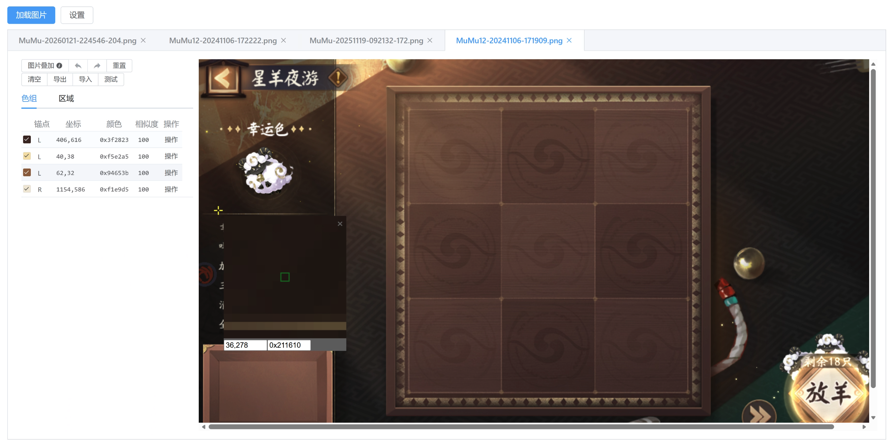

## Color Helper
图色助手，为 [assttyys_autojs](https://github.com/zzliux/assttyys_autojs) 提供专业的取色、分析工具。

## 使用 & 开发
按一般逻辑取色，但该工具主要为锚点比色服务：
1. 键盘ASD分配取按锚点LCR取色；空格或鼠标左键根据屏幕位置自动设置锚点（但大概率不准，需要根据游内的实际控件位置的对齐方向设置）
2. 支持多区域添加，找色也根据所选区域进行找色；
3. 执行器扩展：参考`src/components/ColorHelper/executor/DefaultExecutor.ts`，实现`IExecutor`接口，并在`src/components/ColorHelper/index.ts`中调用`registerExecutor`注册执行器
4. 因浏览器限制，adb截图需额外本地运行独立的桥服务，内测中联系作者获取

## 感谢
 - [yiszza/ScriptGraphicHelper](https://gitee.com/yiszza/ScriptGraphicHelper) 综合图色助手，参考了该工具的交互逻辑
 - [yiszza/ScriptLib](https://gitee.com/yiszza/ScriptLib) 锚点比色、找色工具，本项目将该项目的关键算法从java移植到了ts
